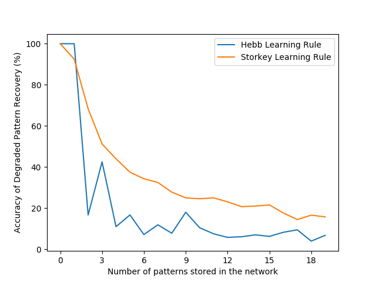

# Neural Networks

We studied neural networks and applied them to text recognition and face recognition as part of the COMP4107 course at Carleton University.

This work was done by myself, Basim Ramadhan, and my partner Christian Abbott.

## General Image Recognition on Tiny Imagenet

For our end-of-course project, we aimed to classify images from the [Tiny Imagenet](https://paperswithcode.com/dataset/tiny-imagenet) dataset.

We referred to network structures and techniques use by [YOLO](https://arxiv.org/abs/1506.02640) and [AlexNet](https://en.wikipedia.org/wiki/AlexNet), and made derived simplified versions that we could run on a single GTX 970 GPU card.

## Text Recognition

### Using feed-forward neural networks

We used neural networks to recognize numbers from the [MNIST dataset](https://en.wikipedia.org/wiki/MNIST_database).

Check out the [write-up](a2/write-up.pdf).

Our best model achieved an accuracy of 96%:

### Experimenting with Hopfield networks

We experimented with using Hopfield networks to remember images using Storkey's and Hebb's learning rules for later retrieval.

See part 1 of [this write-up](a3/write-up/write-up.pdf).

#### Accuracy attained with Hebb's vs. Storkey's rules

#### Visualization of a Hopfield ntwork

#### Image restoration from a Hopfield network

### Experimenting with self-organizing maps (SOM)

Continuing with the MNIST dataset, we experimented with using SOMs to recognize the hand-written numbers.

See part 2 of [this write-up](a3/write-up/write-up.pdf).

#### Visualizing the state of a SOM

#### K-means clustering of the MNIST data reduced to 2D

## Face Recognition

We used neural networks to recognize faces from the [LFW dataset](http://vis-www.cs.umass.edu/lfw/).

See part 3 of [this write-up](a3/write-up/write-up.pdf).

We were able to achieve an accuracy of 83% in recognizing faces using a regular feed-forward network.

We then used [principal component analysis (PCA)](https://en.wikipedia.org/wiki/Principal_component_analysis) to reduce the size of the network and see how much accuracy it retains:

## General Image Recognition on CIFAR-10

Later in the course, we tackled the [CIFAR-10](https://www.cs.toronto.edu/~kriz/cifar.html) dataset, which contains images of various animals and objects.

We used [convolutional neural networks (CNNs)](https://en.wikipedia.org/wiki/Convolutional_neural_network) for this task.

We achieved an accuracy of 75%:

Check out [our write-up here](a4/write-up.ipynb).
